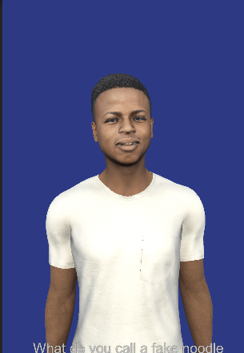

# AI Avatar - Voice-Interactive Virtual Character

A Unity project that integrates Google AI and Meta technologies to build an AI virtual character with natural conversation, voice interaction, and accurate lip-sync.


---

## Demo



---

## Overview

This project implements a complete voice conversation pipeline in Unity:
user speaks into the microphone → Speech-to-Text (STT) → AI generates a reply (Gemini) → Text-to-Speech (TTS) → the avatar speaks with lip-sync (Lip Sync).

---

## Key Tech Stack

| Module | Tech | Description |
|------|------|------|
| **Intelligence** | Gemini API | Uses Google Gemini 2.5 Flash for natural language conversation and context understanding |
| **Communication** | Google STT & TTS | Integrates Google Cloud Speech-to-Text and Text-to-Speech for two-way voice interaction |
| **Realism** | Meta Person Lip Sync | Uses Meta (Oculus) Lip Sync to drive accurate mouth shapes from audio |

---

## System Flow

```
User voice (microphone)
    ↓
Google Speech-to-Text (speech recognition)
    ↓
Gemini API (reply generation)
    ↓
Google Text-to-Speech (speech synthesis)
    ↓
AudioSource playback + Meta Lip Sync (lip-sync)
    ↓
Avatar speaks naturally
```

---

## Requirements

- **Unity**: 6000.0.58f2 (Unity 6) or a compatible version
- **OS**: Windows 10/11
- **Permissions**: Microphone access

---

## Dependencies

- **Meta Person Loader** (`com.avatarsdk.metaperson.loader`) - [avatarsdk/metaperson-loader-unity](https://github.com/avatarsdk/metaperson-loader-unity)

- `com.unity.render-pipelines.universal` - URP (Universal Render Pipeline)
- Google Cloud APIs (you need to create your own credentials)

---

## Project Origin

This project is modified from [Gemini-Unity-Google-Cloud](https://github.com/UnityGameStudio/Gemini-Unity-Google-Cloud) (originally built on Ready Player Me):

- **Original**: uses Ready Player Me avatars
- **Changes in this project**: replaced the avatar with **Meta Person** and integrated Meta Lip Sync

### References

| Module | Source |
|------|------|
| **Gemini + STT architecture** | [UnityGameStudio/Gemini-Unity-Google-Cloud](https://github.com/UnityGameStudio/Gemini-Unity-Google-Cloud) |
| **TTS integration** | [anomalisfree/Unity-Text-to-Speech-using-Google-Cloud](https://github.com/anomalisfree/Unity-Text-to-Speech-using-Google-Cloud) |
| **Meta Person Loader** | [avatarsdk/metaperson-loader-unity](https://github.com/avatarsdk/metaperson-loader-unity) |
| **Meta Person + Lip Sync sample** | [avatarsdk/metaperson-oculus-unity-sample](https://github.com/avatarsdk/metaperson-oculus-unity-sample) |

---

## API Setup

### Google TTS & STT (Speech Recognition & Synthesis)

1. Go to [Google Cloud Console - Credentials](https://console.cloud.google.com/apis/credentials)
2. Create or select a project
3. Enable the following APIs:
   - **Cloud Speech-to-Text API** (speech recognition)
   - **Cloud Text-to-Speech API** (speech synthesis)
4. Create an **API key**: APIs & Services → Credentials → Create Credentials → API key
5. Paste the key into `googleCloudApiKey` in `Assets/Resources/Config/ApiKeysConfig.asset`

### Gemini API (AI Chat)

1. Go to [Google AI Studio - API keys](https://aistudio.google.com/api-keys)
2. Sign in and click "Create API key"
3. Paste the key into `geminiApiKey` in `Assets/Resources/Config/ApiKeysConfig.asset`

---

## Quick Start

### 1. API Keys (Centralized)

All API keys are configured in **`Assets/Resources/Config/ApiKeysConfig.asset`**:

| Service | Usage | Field |
|------|------|----------|
| **Gemini API** | AI chat | `geminiApiKey` |
| **Google Cloud API** | STT + TTS | `googleCloudApiKey` |

- On first launch, the Unity Editor will auto-create `ApiKeysConfig.asset` (if it doesn't exist)
- This file is in `.gitignore`, so **it will not be committed to Git** (safe to put keys here)
- If it wasn't created automatically, use **Config → Create API Keys Config** from the menu

> If you haven't created the APIs yet, see [API Setup](#api-setup).

### 2. Open the Main Scene

Open `Assets/Scenes/Meta+GoogleTTS+Germini.unity` to try it out.

### 3. Controls

- **Hold Space**: start recording
- **Release Space**: stop recording, send to Gemini, then wait for the AI reply and audio playback

---

## Project Structure

```
Assets/
├── Config/                  # centralized API key config
│   ├── ApiKeysConfig.cs         # ScriptableObject definition
│   └── Editor/                  # editor script to auto-create config
├── GeminiManager/           # core pipeline: chat + voice
│   ├── UnityAndGeminiV3.cs      # Gemini integration, dialog logic, TTS wiring
│   ├── GoogleCloudSpeechToText.cs   # Google STT calls
│   ├── SpeechToTextManager.cs       # microphone recording, STT trigger
│   └── TextToSpeechManager.cs      # TTS playback manager
├── GoogleTextToSpeech/      # Google Cloud TTS package
│   ├── Scripts/TextToSpeech.cs
│   └── Voices/              # multilingual voices (zh-TW, en-US, etc.)
├── MetaLipAvator/           # Meta lip-sync
│   ├── AvatarSDK/MetaPerson/   # Meta Person avatar model
│   └── Oculus/LipSync/         # OVRLipSync driver
├── Scenes/
│   └── Meta+GoogleTTS+Germini.unity   # main scene
└── _Script/
    └── EyeLookAtCamera.cs   # eyes look-at camera
```

---

## Features

- **Multi-turn chat**: supports conversational context for continuous dialog
- **Multilingual**: STT supports zh-TW, zh-CN, en-US, etc.; TTS supports multiple voices/languages
- **TTS text sanitization**: filters Markdown and emoji to keep narration smooth
- **Lip-sync**: Meta Lip Sync is driven by TTS audio for accurate mouth movement

---

## Licenses & Credits

- **Meta Lip Sync**: Oculus Audio SDK License
- **Google APIs**: subject to Google Cloud terms of service
- **Gemini API**: subject to Google AI terms of service
- **Base project**: [Gemini-Unity-Google-Cloud](https://github.com/UnityGameStudio/Gemini-Unity-Google-Cloud) (Ready Player Me)
- **TTS package**: [Unity-Text-to-Speech-using-Google-Cloud](https://github.com/anomalisfree/Unity-Text-to-Speech-using-Google-Cloud)
- **Meta Person sample**: [avatarsdk/metaperson-oculus-unity-sample](https://github.com/avatarsdk/metaperson-oculus-unity-sample) (official Meta Person + Oculus Lip Sync sample)

---

## Version Info

- Unity 6 (6000.0.58f2)
- Gemini 2.5 Flash
- Meta Person Avatar SDK
